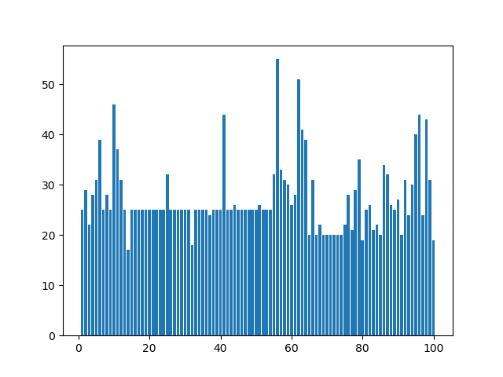

# 百度-西交大·大数据竞赛2018——商家招牌的分类与检测

## 赛题介绍及结果

> 本次大赛分为初赛、复赛和决赛三个阶段，其中：初赛为招牌图像分类竞赛，由参赛队伍下载数据在本地进行算法设计和调试；复赛为招牌图像检测+分类竞赛，提供线上开发环境，参赛队伍可依自身需求选择使用；决赛要求参赛者进行现场演示和答辩。初赛为2018年4月30日到2018年6月8日，每天10点进行一次排名，结束时取前100名。复赛以及决赛就不提了。。。（倒在了初赛）

>初赛主要是图像分类，数据集不大（170.98M），测试集1000张图片；训练集共计100类2725张图片，数据略有不均衡，最少一类17张，最多55张。
>

>最终结果准确率98.7%，排名132/1139，止步初赛

## 比赛总结
1. 时间安排方面
准确来说时从5月2号才开始做比赛，刚开始两天还是蛮有动力的；但是后来时间确实安排不好，中间有大部分时间都是在做工程认证，有很多边角时间也没有充分利用（但是利用也好像没办法利用，毕竟训练一个模型怎么都要半个小时）。
2. 模型应用方面
环境：Nvidia1070Ti GPU，ubuntu，keras（tensorflow）
因为数据量不大，只能考虑微调预训练模型的方式，尝试了很多keras集成的预训练模型，包括Resnet50、Xception、Densenet、InceptionResnetV2四个模型。四个模型中，首先使用的是Resnet50，获得了93%的准确率（讨论区93%的baseline），Densenet模型并没有预想的好，仅仅比Resnet好一点；但是Xception取得了出乎意料的表现，加上一些增强，能够取得97.6%的准确率；至于InceptionResnetV2模型，由于显存不够，小批量训练的情况下也能获得96%的准确率。
3. 技巧方面
- 微调的层数越多，效果越好
- 单纯的dropout没有BN的效果好，但是两者搭配食用效果很好
- BN加的地方需要注意，在本次比赛中，BN加在了softmax之前，准确率提升明显
- 图像在resize的时候要不要保持宽高比需要注意
- 图像增强是必要的，但是还没掌握（这一点需要提高）
- 模型融合是我能想到的最后的一招了，投票是可以的，但是按比例相加能获得更好的效果，这个比例需要validation集来确定的
- 另外，初赛其实有些许的作弊（可笑的是作弊还没进复赛。。。），队友把测试集的标签人工标到了100%，测试集被我用来确定模型融合的超参了，这是错的！！